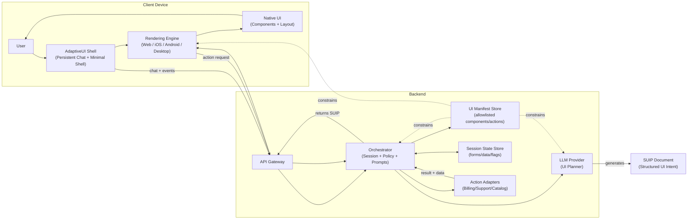

# AdaptiveUI

**AdaptiveUI** is an experimental UI infrastructure project that explores a new paradigm:

> **Stateful, intent-driven user interfaces compiled by an LLM and rendered natively on any device.**

Instead of hard‑coding pages, flows, and navigation, AdaptiveUI introduces a **Structured UI Intent Protocol (SUIP)** that allows Large Language Models to describe *what the user should see and do next*, while platform-specific rendering engines decide *how* that experience is presented.

This project is inspired by the success of **Model Context Protocol (MCP)** for tool invocation and applies the same idea to **UI and UX**.

---

## Core Idea

Traditional UI development couples:
- User intent
- Visual layout
- Interaction logic
- Platform-specific implementation

AdaptiveUI **decouples** these concerns:

```
LLM (Intent & Planning)
        ↓
Structured UI Intent Protocol (SUIP)
        ↓
Rendering Engine (Web / iOS / Android / Desktop / Voice)
        ↓
Native UI
```

## Concept + Architecture (Mermaid)



---

As long as a platform has a compliant rendering engine, **the same SUIP document can drive the experience everywhere**.

---

## Key Concepts

### 1. Structured UI Intent Protocol (SUIP)

SUIP is a **device-agnostic, schema-validated protocol** that allows an LLM to express:
- Layout intent (stack, grid, modal, etc.)
- UI components (text, forms, lists, buttons)
- User interactions (actions, navigation)
- Data bindings and validation
- Accessibility semantics

📄 See: [`docs/Structured_UI_Intent_Protocol_SUIP.md`](docs/Structured_UI_Intent_Protocol_SUIP.md)

---

### 2. Rendering Engines

Rendering engines are **thin runtimes** that:
- Validate SUIP documents
- Map protocol components to native UI widgets
- Enforce design systems and accessibility
- Execute actions through approved adapters

Each platform implements its own renderer while sharing the same protocol.

---

### 3. LLM Orchestration Layer

The LLM does **UI planning**, not rendering.

It receives:
- Conversation history
- Session state
- Allowed component/action manifest

It produces:
- Deterministic, schema-valid SUIP documents

Guardrails ensure safety, consistency, and cost control.

---

## Why AdaptiveUI?

### Problems with Traditional UI
- High development and maintenance cost
- Rigid, pre-defined user flows
- Slow iteration cycles
- Poor alignment with real user intent

### Benefits of AdaptiveUI
- Intent-first UX
- Fewer hard-coded pages
- Faster iteration (no redeploys for UX changes)
- Portable UI across platforms
- Natural fit for conversational experiences

---

## Repository Structure (Planned)

```
adaptive-ui/
├── README.md
├── docs/
│   ├── AdaptiveUI_PRD.md
│   └── Structured_UI_Intent_Protocol_SUIP.md
├── suip/
│   ├── schema/
│   │   └── suip.schema.json
│   └── examples/
│       └── billing_flow.json
└── rendering-engines/
    └── web/
```

---

## Status

🚧 **Early design / exploration phase**

Current focus:
- Formalizing the SUIP protocol
- Defining schema + validation rules
- Establishing rendering constraints and guardrails

---

## Non-Goals (for now)

- Replacing all traditional UI frameworks
- Arbitrary HTML or JavaScript generation
- Pixel-perfect cross-platform uniformity

AdaptiveUI prioritizes **intent fidelity over visual sameness**.

---

## Who This Is For

- AI / LLM infrastructure engineers
- Frontend and platform engineers
- Product teams exploring intent-based UX
- Developers interested in protocol-driven UI

---

## License

TBD (likely Apache 2.0 or MIT)

---

## Vision

AdaptiveUI aims to become:

> **A universal protocol and runtime for conversationally compiled user interfaces.**

If MCP standardized how LLMs *use tools*, AdaptiveUI explores how LLMs can *author experiences*.

---

## Next Steps

- Define SUIP v0.1 JSON Schema
- Build a reference web rendering engine
- Create a system prompt for SUIP generation
- Publish example flows (support, billing, onboarding)

Contributions and discussion welcome once the protocol stabilizes.

