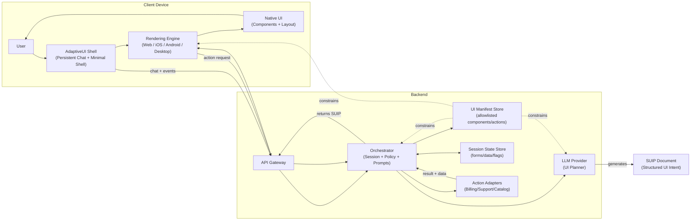
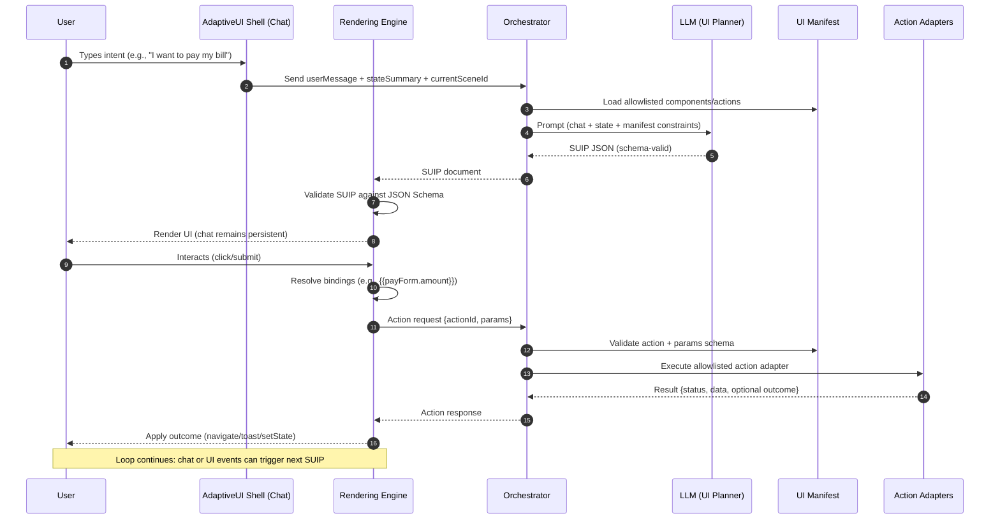

# Diagrams

This document contains Mermaid diagrams to visually explain AdaptiveUI and SUIP.

> Tip: GitHub renders Mermaid in Markdown automatically.

---

## One-Pager: AdaptiveUI + SUIP (Concept + Architecture)

---

## Sequence Diagram: Core Runtime Loop

